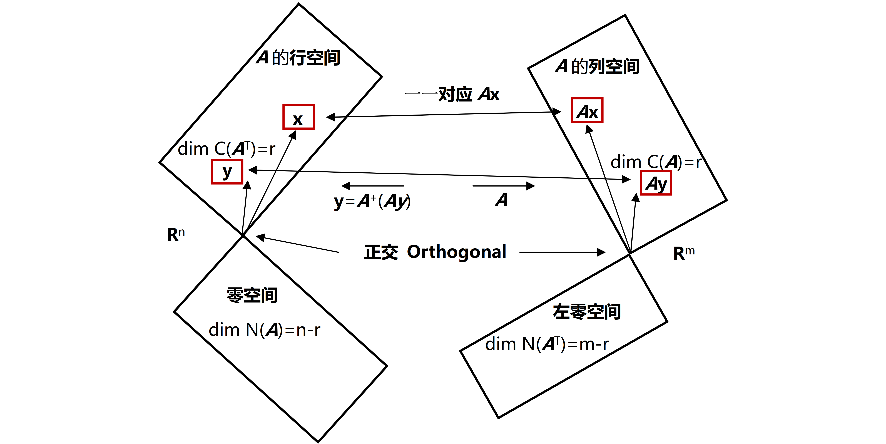
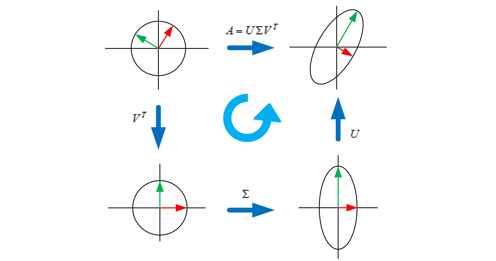

​         ​            

**这是对MIT 18.06 open course-- Linear Algebra--by Gilbert Strang 的课程总结。**

## 课程视频及主页资料

由于计算机视觉以及机器学习中对矩阵的要求较高，而且本科阶段的高等代数学得不太行，故借此机会将这个著名的MIT线性代数公开课看了一遍，相关的课程视频和材料放在下面。

- [lectures:](https://www.bilibili.com/video/av15463995?p=2)

- [readings:](https://ocw.mit.edu/courses/mathematics/18-06-linear-algebra-spring-2010/readings/)

- [assignments:](https://ocw.mit.edu/courses/mathematics/18-06-linear-algebra-spring-2010/assignments/)

- [exams:](http://math.mit.edu/~gs/linearalgebra/)

- [tools:](https://ocw.mit.edu/courses/mathematics/18-06-linear-algebra-spring-2010/tools/)

<!--more-->

## 课程脉络

Gilbert老爷子这门线代课应用性很强，在课堂上经常结合工程实际来探讨矩阵在其中的应用和联系，比如在对投影，最小二乘法原理以及求解矛盾方程组的三者之间用$A^{T}A$进行联系，这中“惊人”的发现也进一步加深了我对线性代数的通用性认识，所以这门课对搞了一些研究回过头来听的人来说很有启发，有时候没事可以时常翻翻这门课的教材。

这门课的核心思想就是老爷子的那张著名的”four subspaces"图，如下图所示。整门课分为三个部分：$Ax=b$和四个子空间；最小二乘法，行列式和特征值；正定矩阵以及应用。

Gilbert先从方程组入手，指出现实生活中的问题抽象成一系列方程，组成方程组，因此矩阵的出现是为了应对消元求解方程组，同时利用系数矩阵来从另一个层面认识这个系统的性质，比如可解性，稳定性等等，在这里，Gilbert将系数矩阵看成是向量的线性组合，从而直接转成空间的角度来看待“解”，这也是该部分的一个重要思想。矩阵也会表示空间，最基本的思想是把矩阵认为是n个列向量组成的，研究这些列向量彼此之间的关系来来研究矩阵代表的空间。求解问题也变成是列向量的线性组合。矩阵的行变换代表着消元法，同时也会引发矩阵的分解，求解Ax=b时转换成矩阵的列空间和零空间来二分，特定解和特殊解。之后引申出四个基本子空间：行空间，零空间，列空间，左零空间，进而指出空间的维数和基。

第一部分的关键词就是**消元，向量，线性组合和空间**。矩阵，空间，方程组之间是等价的。

到了第二部分，Gilbert开始引入行列式。他先从正交矩阵讲起，即$A^{T}A=I$，指出了它在投影，最小二乘，求解矛盾方程组之间的作用，并且利用它把这些问题都联系在了一起。其本质的原因可能是所谓的”空间度量，距离最小“，然后系数矩阵$A$恰好用这种方式呈现出来。之后引入行列式就很自然了，因为要求”大小“或者”长度“。Gilbert通过三个基本的性质定义了矩阵的行列式，并且推导出了其他几种性质，然后顺带着给出了行列式的计算公式和求解方程组的作用，及求逆公式，虽然他并不推崇这种死板的大计算量的方法来求解。最后，Gilbert借着行列式给出了矩阵的特征值，特征向量，以及特征值在对角化和其他工程中的应用（行列式的作用就是对角化）。不过比较可惜的一点是，教授并没有深层次探讨矩阵的特征值的意义，仅仅是从特征值公式上说”向量经过矩阵变换后方向不变“，虽然后来的例子又将特征值特征向量与主轴定理结合起来，但是依然没有一种很明晰的感觉。可能因为这是工科课程，重在讲解应用和联系。。希望我后面能在”linear algebra done right"这本书里找到答案。

最后一部分的主题是正定性，这类似与函数当中的最小值对应条件问题。这一部分我看得比较乱，没看出什么真正的名堂出来，毕竟从内容上我没找出什么联系。我后来问了数学系的同学，他说正定矩阵是为了定义内积空间（又称希尔伯空间，量子力学就是定义在这个上面）。这里面涉及到多元函数最小值判定，酉矩阵，以及奇异值分解，因此还是比较重要的内容。

实际上呢，教授是从多元线性方程组的角度来讲线性代数和矩阵的，因此并不像数学系那样从映射，集合、环、域，空间，然后到空间结构，代数，多元数组的关系来展开讲。因为是工科课程，所以第一关心的问题是怎么用，后面才会去进一步关注如何产生这种思想的问题，在这里，Gilbert教授关注的是矩阵角度解方程组，诸如矩阵分解、对角化，投影，正交矩阵，正定矩阵都是为了和工程中实际方法相联系和结合，因此可以看作是一种“top-down"的讲授思维。

对于做SLAM和机器学习来讲，关注更多的好像还是数值矩阵求解，即如何利用数值计算工具，更有效，更准确的分解、求解矩阵，所以，我接下来还得继续看fast.ai的numerical linear algebra课了。。

## 阅读材料

这门课除了Gilbert Strang的那本教材，还有一些其他的资料，我把它们都托管到了我的[Github](https://github.com/Richardyu114/MIT-Linear-Algebra-Learning-Materials)上，有需要的请自取。

清单如下：

- Introduction to Linear Algebra

- 超详细MIT线性代数公开课笔记

- 神奇的矩阵第一季

- 神奇的矩阵第二季

- 线性代数的几何意义

- Linear Algebra Done Right

另外也有其他几本线性代数教材也不错：

- **圣经** Linear Algebra-hoffman 

- Linear Algebra and Its Applications-David C. Lay
- Introduction to Applied Linear Algebra--Vectors, Matrices, and Least Squares

------

------

看完《线性代数的几何意义》和《神奇的矩阵》来更 

------

-----

## 线性代数的几何意义

### 线性代数

- 代数的功能是进行抽象，为了解决问题的方便，提高效率。线性代数里面的线性主要是指线性空间里面的线性变换（可加性和比例性），通过**线性算子**定义了线性变换，也就是变换满足可加性和比例性，实际上，差分，微分都是一种数学上的算子，代表一种运算关系。

### 行列式

- 行列式的几何意义具有深刻的含义。它是指行列式的行向量或列向量所构成的平行多面体的有向体积。这个有向体积是由许多块更小的有向面积或有向体积的累加。行列式的几何意义是什么呢？**概括说来有两个解释：一个解释是行列式就是行列式中的行或列向量所构成的超平行多面体的 有向面积或有向体积；另一个解释是矩阵 $A$ 的行列式 $detA$ 就是线性变换 $A$ 下的图形面积或体积的伸缩因子。一个给定的行列式，它的行向量顺序也给定了，不能随意改变其顺序。**
- 一个行列式的整体几何意义是有向线段（一阶行列式）或有向面积（二阶行列式）或有向体积（三阶行列式及以上）。因此，行列式最基本的几何意义是由各个坐标轴上的有向线段所围起来的所有有向面积或有向体积的累加和。这个累加要注意每个面积或体积的方向或符号，方向相同的要加，方向相反的要减，因而，这个累加的和是代数和。
- 行列式的乘积项及其逆序数的几何意义实际上是行列式最根本的几何意义，因而可以解释所有的行列式的定义及其性质。

### 向量空间

- 设$V$是非空的n维向量的集合(n=1,2,3...)，如果$V$中的向量对加法和数乘两种运算封闭，即：

$$
\begin{align*}
& 1. 若\overrightarrow{a},\overrightarrow{b} \in V,则\overrightarrow{a}+\overrightarrow{b} \in V \\

& 2. \overrightarrow{a} \in V,则k\overrightarrow{a} \in V,k为任意实数
\end{align*}
$$

​         则称$V$为向量空间。

- 向量空间主要有两种：一种是由 V 中的一个向量组张成的空间（比如由特征向量张成的子空间等）。另外一种齐次线性方程组的解集组成的解空间。实际上，线性方程组的解空间也是解向量所张成，这两种空间里都包含有无穷多的向量。
- 值得注意的是，**所有的子空间一定要包含零空间在内**。实际上，我们现在讨论的向量，不能称之为自由向量，因为所有的向量的尾巴都被拉到了原点上，或者说，所有向量空间里的向量都是从原点出发的，大家都有一个共同的零空间，这就是为什么所有的子空间一定要包含零空间的原因了。
- 为什么要把向量的尾部都拉到原点是为了研究向量的方便，因为这样就可以把向量和空间中的点一一对应起来。空间中一旦建立起了坐标系，点有坐标值，那么我们就用点的坐标表示与点对应的向量，这样向量就有了解析式，就有了向量的坐标表达式，我们就可以方面的使用代数中的矩阵技术进行分析及计算了。如果一个子空间没有通过原点，那么从原点出发的向量必然首尾不顾，造成了向量头在子空间中尾在空间外（因为原点在空间外）。当然，向量的加法和数乘也都跑到子空间外面去了。
- 内积的定义要解决空间中不同的基带来不同坐标度量带来向量长度和夹角的变化。可以通过**内积度量矩阵**$P^{T}P$来解决此问题，无论你变了多少次基，每变一次基同时就改变一次度量矩阵，从而来保证内积值的不变性，这样也就保证了向量空间度量的一致性，达到了度量值不随坐标改变而改变的目的。

###  矩阵

- 我们知道，在直角坐标系中，一个有序的实数数组$(a,b)$和$(a,b,c)$分别代表了平面上和空间上的一个点，这就是实数组的几何意义。类似的，在线性空间中如果确定了一个基，线性映射就可以用确定的矩阵来表示，这就是矩阵的几何意义：线性空间上的线性映射。矩阵独立的几何意义表现为对向量的作用结果。
- 如果用数组来统一定义标量、向量和矩阵的话就是：**标量是一维向量，向量是标量的数组，矩阵则是向量的数组。**
- 矩阵与向量乘积比如$Ax$表现为矩阵$A$对一个向量$x$作用的结果。其作用的主要过程是对一个向量进行旋转和缩放的综合过程（即线性变换的过程），一个向量就变换为另外一个向量。一个 m 行 n 列的实矩阵$A_{m \times n}$就是一个$R^{n} \rightarrow R^{m}$上的线性变换，或者说，矩阵$A_{m \times n}$把一个n维空间的 n 维向量变换为一个m维空间的m维向量。

- 一个矩阵乘以一个向量，一般将会对向量的几何图形进行旋转和伸缩变化，而旋转矩阵只对向量进行旋转变化而没有伸缩变化，例如二阶旋转矩阵$A$：

$$
A=
\begin{pmatrix}
\cos \theta & -\sin \theta \\
\sin \theta & \cos \theta

\end{pmatrix}
$$

- 如果将上面的旋转矩阵分别按行向量和列向量来看，随着角度的增大，行向量在顺时针旋转，而列向量在逆时针旋转，“这正是正交矩阵的特征”（然而这一结论的得出还不是很明了）。旋转矩阵为正交矩阵。
- 矩阵与矩阵的相乘的几何意义，可以从矩阵与多个向量相乘的几何意义得到，只是多个向量被按照顺序组合成了另一个矩阵。

- **实际上，从$R^{n} \rightarrow R^{m}$上的线性变换都可以表述为一个矩阵变换；反过来，一个矩阵变换也必然是一个线性变换。两者具有一一对应的关系。一个矩阵变换也必然是一个线性变换。**这个对应关系笼统地表述如下：
  - 线性变换的和对应着矩阵的和；
  - 线性变换的乘积对应着矩阵的乘积；
  - 线性变换的数量乘积对应着矩阵的数量乘积；
  - 线性变换的逆对应着矩阵的逆；

- 下面的定理给出了如何把一个$R^{2}$空间上的线性变换转换成一个对应的 2 阶矩阵的办法:

$$
定理：设T:R^{2} \rightarrow R^{2}是一个线性变换，那么T的矩阵的列向量为T(e_{1})和T(e_{2})
$$

- 由于线性变换与矩阵之间有一一对应（在给定基的前提下），而且保持线性运算关系不变（线性变换的加法和数乘分别对应于在某一个基下的矩阵的加法和数乘），因此，可以用矩阵来研究线性变换，也可以用线性变换来研究矩阵。
- 常见的线性变换有初等变换、等价变换、相似变换、合同变换等。我们也常常听到正交变换的名字，但由于正交变换包括平移、旋转和镜像，我们知道平移变换不是线性变换，因此不是所有的正交变换是线性变换。
- 一个矩阵就是把第一象限的单位立方体变换到其他象限的多面体，单位立方体由单位基向量张成，多面体由矩阵列向量张成；而列向量是由基向量变换得到的。
- **对于n阶方阵，把列看作列向量，则行是每个列向量在列空间各个坐标轴上的投影（坐标），行的数量则是列空间坐标系的维数。**
- 特征值和特征向量的几何意义：$Ax=\lambda x$ 
  - 方阵乘以一个向量的结果仍然是一个同维向量，矩阵乘法对应了一个变换，把一个向量变成同维数的另一个向量。在这个变换的过程中，向量会发生旋转、伸缩或镜像的变化。矩阵不同，向量变化的结果也会不同。如果矩阵对某一个向量或者某些向量只发生伸缩变换，不对这些向量产生旋转效果，那么这些向量就是这个矩阵的特征向量，伸缩的比例就是特征值；如果伸缩的比例值是负值，原向量的方向改变为反方向，原向量仍然是这个矩阵的特征值。因此，从矩阵的几何意义上看，矩阵$A$的特征向量$\overrightarrow a$就是经过矩阵$A$变换后与自己平行的非零向量，矩阵$A$的特征值$\lambda$就是特征向量$\overrightarrow a$经变换后的伸缩系数（复特征值会使特征向量在复平面进行旋转，但在实轴上仍然是只进行伸缩变换）。
  - 特征值反映了特征向量在变换时的伸缩倍数。对一个变换而言。特征向量指明变换的方向，而特征值反映的是变换的剧烈程度！我们知道，一个矩阵，只要我们找到合适的坐标，它的全部信息就可以用坐标系和特征值表示。这里蕴含了一个哲理：**我们从不同角度看问题，其难易程度是不一样的！而矩阵对角化为我们提供了一个很好的看问题的角度**。
  - 矩阵的特征值之和等于矩阵的迹，特征值之积等于矩阵的行列式。这个由二阶矩阵推广而来。
  - 关于特征值和特征向量，一是注意线性不变量的含义，一个是振动的谱含义。特征向量是线性不变量，特征值是振动的谱。机械振动和电振动有频谱，振动的某个频率具有某个幅度，那么矩阵也有矩阵的谱，矩阵的谱就是矩阵特征值的概念，是矩阵所固有的属性，所有的特征值形成了矩阵的一个频谱，每个特征值是矩阵的一个“谐振频点”。**矩阵的谱分解就是抓住了矩阵的主要矛盾**，因此也是主成分分析（PCA），奇异值分解相关的内容。
  - 矩阵之所以能形成“频率的谱”，就是因为矩阵在特征向量所指的方向上具有对向量产生恒定的变换作用：周期性地增强或减弱特征向量的作用。进一步地，如果矩阵持续地叠代作用于向量，那么特征向量就会凸现出来。可类比与电路中的振荡器。

- 几何重数与代数重数：一个特征值的求解因式的次数称为代数重数，特征值的特征子空间的维数称为几何重数。一般来说，特征值的代数重数大于或等于几何重数。
- 相似矩阵：或矩阵$A$与矩阵$B$相似，一定存在一个非奇异矩阵$P$（基变换矩阵），有$A=PBP^{-1}$。**核心的几何意义就是相似矩阵$A$和$B$是同一个线性变换在两个不同基下的表示矩阵。**线性变换的相似对角化实质是寻找一个适当的坐标系，使得该变换对这个新的坐标系上的单位向量（或基向量）只做伸缩变换，不做旋转变换。
- 不是任何矩阵都可以相似对角化，除非由n个线性无关的特征向量，但是实对称矩阵一定可以对角化。这里的证明涉及到一系列定理：

$$
\begin{align*}
& 定理1： 实对称矩阵A的特征值都是实数 \\
& 定理2： 实对称矩阵A的不同特征值对应的特征向量一定是相互正交的（正交的向量组一定是线性无关向量组）\\
& 定理3： 实对称矩阵A的r重特征根\lambda一定有r个线性无关的特征向量
\end{align*}
$$

- 雅可比矩阵：雅可比矩阵是线性代数和微积分的纽带，是把非线性问题转换为线性问题的有力工具之一。
- 一个函数方程组由n个函数构成，每个函数有n个自变量$x_{1},x_{2},x_{3},\cdots x_{n}$

$$
\begin{cases}
y_{1}=f_{1}(x_{1},x_{2},\cdots x_{n}) \\
y_{2}=f_{2}(x_{1},x_{2},\cdots x_{n})\\
\vdots \\
y_{n}=f_{n}(x_{1},x_{2},\dots x_{n})
\end{cases}
$$

- 一般情况下，该函数方程组不是线性方程组，是多维曲线、曲面类的，通过微积分的思想化曲为直，将上述方程组化为超维切平面。先偏微分再写成矩阵的形式：

$$
\begin{pmatrix}
dy_{1}\\
dy_{2}\\
\vdots\\
dy_{n}
\end{pmatrix}
=
\begin{bmatrix}
\frac{\partial f_{1}}{\partial x_{1}} & \frac{\partial f_{1}}{\partial x_{2}} & \cdots & \frac{\partial f_{1}}{\partial x_{n}}\\

\frac{\partial f_{2}}{\partial x_{1}} & \frac{\partial f_{2}}{\partial x_{2}} & \cdots & \frac{\partial f_{2}}{\partial x_{n}}\\

\vdots & \vdots & \cdots & \vdots \\

\frac{\partial f_{n}}{\partial x_{1}} & \frac{\partial f_{n}}{\partial x_{2}} & \cdots & \frac{\partial f_{n}}{\partial x_{n}}

\end{bmatrix}

\begin{pmatrix}
dx_{1}\\
dx_{2}\\
\vdots\\
dx_{n}
\end{pmatrix}
$$

- 其中，中间的方块矩阵就是雅可比矩阵$J$，里面的元素一般不是常数，而是变量或函数，说明雅可比矩阵包含着很多个具体的变换矩阵。
- **雅可比矩阵把一个超平面的仿射坐标系变换成了一个超曲面坐标系；雅可比行列式就是曲面坐标系下单位微元和仿射坐标系下单位微元面积的比值。（雅可比矩阵把一个空间里的一个平面坐标系（基）变换成了无数个极小平面坐标系（基）；无数个极小平面就是曲面的切平面；雅可比行列式就是切平面上每个坐标系下极小单位元和原坐标系下极小单位元面积的比值。）**

- 整个线性代数里矩阵之间有三种典型的关系：矩阵相似（similar）、矩阵等价（equivalent）、矩阵合同（congruent）：

$$
\begin{align*}
& (1) A和B等价 \Leftrightarrow 存在可逆矩阵P和Q，使得B=PAQ；\\
& (2) A和B相似 \Leftrightarrow 存在可逆矩阵P，使得B=P^{-1}AP;\\
& (3) A和B合同 \Leftrightarrow 存在可逆矩阵C，使得B=C^{T}AC.
\end{align*}
$$

- 矩阵相似，矩阵合同一定说明矩阵等价，但是相似与等价之间没有必然的联系，除非是正交矩阵，则两个等价。它们的几何意义如下：
- **两个有限维向量空间之间的同一个线性映射，其在这两个向量空间上的不同基下所对应的矩阵之间的关系就是等价关系。** 就是说它们是同一种类型的子空间，变换的作用就是为了把元素之间相互干扰的矩阵化成能一眼看出维数的简单矩阵。因为$P$和$Q$对应行初等变换和列初等变换的叠加，这里只能反映空间的维数。然而，在一些实际工程中，这些信息对我们了解一个系统已经足够用了。
- **一个有限维向量空间上的同一个线性变换（或称线性算子），其在不同基下所对应的矩阵之间的关系是相似关系。**就是同一个线性变换的不同基的描述矩阵。矩阵的相似变换可以把一个比较丑的矩阵变成一个比较美的矩阵，而保证这两个矩阵都是描述了同一个线性变换。至于什么样的矩阵是“美”的，什么样的是“丑”的，我们说对角阵是美的。总而言之，**相似变换是为了简化计算**。
- **一个有限维向量空间上的同一个双线性函数或内积，其在两个基下的度量矩阵是相合关系。**
- 矩阵$A$，$B$可以不是方阵，因为是不同空间之间的线性映射矩阵，而$P$ ，$Q$，$C$必须是方阵且可逆，因为是同一空间里的基过渡矩阵。矩阵既可以看作向量的变换也可以看作是基的变换，两者的表达式中自变向量和因变向量的位置相反。
- 任一矩阵都可以通过一系列的初等变换化非对角线上的元素为0，从而成为对角阵，因此任一矩阵都等价于一个对角阵，其对角线上的非零元素的个数正好是原矩阵的秩。然而除了秩不变外，矩阵的其他性质在变换以后就很难反映出来了。
- 同构：如果两个线性空间上的映射变换既是单射又是满射，就称这两个向量空间同构。两个向量空间同构，那么就有线性映射使这两个线性空间的向量（或点）一一对应，而且保持线性不变，这时往往将这两个向量空间看作同一个。对于向量空间，同构也是等价关系。所以说，相似变换是同一个向量空间的变换，是两个基上的同一个线性变换。
- 相似矩阵描述的是在不同参照系的同一个变换，动作规则是相同的，类似地，合同矩阵描述的是在不同参照系下的同一个内积的度量矩阵。
- 由前可知，内积的度量应该是不随着坐标系的选取而改变的，因此定义了度量矩阵这个东西。事实上，内积的推广式子为：

$$
(x,y)=x^{T}Sy, S=P^{T}P
$$

- 其中方阵$S$就是度量矩阵，度量矩阵是由基向量所构成的过渡方阵$P$与其转置的乘积得到的。
- 因为度量矩阵$S$是由基的过渡矩阵所决定的，那么每更换一次基坐标系就会有一个新的度量矩阵$T$，它们对应着同一个内积，且$S$合同于$T$。
- 正交变换是保持任意向量的长度不变或者保持度量不变的线性变换，其是欧式空间中的一类重要的变换。正交变换具有合同与相似变换共同的优点，前者仅适用于对称阵，保持了矩阵的对称性、正定性、秩等性质不变；后者适用于一般方阵，保持了矩阵的秩与特征值不变。因为正交变换的矩阵$P$满足$P^{-1} = P^{T}$，实际上是合同变换与相似变换的一种结合。
- 正交变换的主要性质是它不改变几何图形的度量。正交变换对应的矩阵就是正交矩阵，简单地说，一个正交矩阵就是一个具有标准正交列（行）向量组的方阵。

###  线性方程组

- 四个正交子空间。
- 线性方程组的研究，包含了对向量的线性组合和矩阵方程的研究。方程组可以写成矩阵方程和向量组和形式等不同的形式，也反映了研究内容的不同。即线性方程组、向量的线性组合和矩阵及其矩阵方程可作等价研究。

### 二次型

- 二次型的内容就是研究线性空间里的一个几何图形如何在不同的坐标基下的不同的矩阵表示，合同的矩阵表示的是同一个二次函数的几何图形。
- 定义：

$$
\begin{align*}
& 含有n个变量x_{1}，x_{2}，\cdots，x_{n}的二次齐次函数：\\
& f(x_{1}，x_{2}，\cdots，x_{n})=a_{11}x_{1}^{2}+a_{22}x_{2}^{2}+\cdots+a_{nn}x_{n}^{2}+2a_{12}x_{1}x_{2}+2a_{13}x_{1}x_{3}+\cdots+2a_{(n-1)n}x_{n-1}x_{n}\\
& 称为二次型。只含有平方项的二次型称为二次型的标准型：\\
& f(x_{1}，x_{2}，\cdots，x_{n})=a_{11}x_{1}^{2}+a_{22}x_{2}^{2}+\cdots+a_{nn}x_{n}^{2}
\end{align*}
$$

- 二次型可以表示为变元向量和矩阵的乘积：

$$
f(x_{1}，x_{2}，\cdots，x_{n})=
(x_{1}，x_{2}，\cdots，x_{n})
\begin{bmatrix}
a_{11} & a_{12} & \cdots & a_{1n} \\
a_{12} & a_{22} & \cdots & a_{2n} \\
\vdots & \vdots & \cdots & \vdots \\
a_{1n} & a_{2n} & \cdots & a_{nn}
\end{bmatrix}
\begin{pmatrix}
x_{1} \\
x_{2} \\
\vdots \\
x_{n}
\end{pmatrix}
=x^{T}Ax
$$

- 任意给一个二次型，就有唯一确定的对称矩阵，反之，任给一个对称矩阵，也就唯一确定一个二次型，其中，上式中间的方块矩阵称为二次型$f$的矩阵。

- 二次型是向量长度的平方，这个平方值不随坐标基的变化而变化，是个不变量，是绝对性的，而二次型函数的数学表达式却随着坐标基的变化而变化。

- 问题是，线性代数是研究”线性问题“的，比如线性变换、线性空间、线性方程组等，二次型却是非线性的，那为何能用矩阵等线性工具研究？

- 一是二次曲线或曲面本身就具有线性的性质，比如直纹曲面，一个坐标方向是直线，一个坐标方向是二次的，就可以描绘出直纹曲面（比如马鞍面）；

- 二是用向量研究一元多项式，是用多项式的系数构成向量来等价地替代研究，不是直接研究多项式本身，因此化非线性为线性；同样，用二次型的系数构建矩阵来等价地替代研究它，同样化非线性为线性了；

- 三是对二次型的研究利用了双线性函数的概念。二次型本来就是一个对称的双线性函数。

- 双线性函数就是定义了某维线性空间里的双向量的一个运算，运算结果是一个数，这个数属于某个数域。其中一个变元固定时是另一个变元的线性函数，两个向量互为线性，称为双线性。

- 双线性函数的一般定义如下：

$$
\begin{align*}
& 设P^{n}是数域P上n维列向量构成的线性空间，向量x,y \in P^{n}，再设A是P上的n阶方阵。令\\
& f(x,y)=x^{T}Ay \\
& 则f(x,y)是P^{n}上的一个双线性函数。
\end{align*}
$$
- **二次型对角化就是把二次型化简成标准型或者规范型。对角化二次型必须要是矩阵的合同变换，或者说度量矩阵和变换后的度量矩阵必须是合同的，只有这样才能使二次型的函数值保持不变，才能使向量长度保持不变，其他方法比如矩阵的相似对角化不能保证二次型的值不变。因为从几何意义上讲，相似对角化法是使矩阵本身所表示的某种线性变换不变进而对角化，而二次型对角化法是保证矩阵背后所代表二次型的值不变，它们所要求的不变量是不同的。**

$$
f(x)=x^{T}Ax=(Cy)^{T}ACy=y^{T}(C^{T}AC)y
$$
- 对于一个正交矩阵$Q$，有向量替换关系$x=Qy$使：

$$
f(x)=x^{T}Ax=y^{T}(Q^{T}AQ)y=y^{T}(Q^
{-1}AQ)y
$$
- **正交变换既是相似变换同时又是合同变换。由于正交变换保持变换前后的向量内积不变，从而保持向量的长度与夹角不变，所以正交变换属于刚体变换，是代表空间的一个旋转/镜像变换。利用矩阵乘积分解的方法，这种变换的转轴、转角可以用矩阵的特征参数量化地表示出来。**

- 和其他合同变换（又称可逆线性替换）不保持图形的原有形状，如可以把椭圆变成圆的特点相比，正交变换则保持原图形的形状。

- **用正交变换化二次型为标准型的定理也称为主轴定理，这同时也是主轴定理的几何意义。**

- 主轴定理：

$$
\begin {align*}
& 对于任意一个n元二次型：\\
& f(x_{1}，x_{2}，\cdots，x_{n})=x^{T}Ax\\
& 存在正交变换x=Qy（Q为n元正交矩阵），使得\\
& x^{T}Ax=y^{T}(Q^{T}AQ)y=\lambda_{1}y_{1}^{2}+\lambda_{2}y_{2}^{2}+\cdots+\lambda_{n}y_{n}^{2}
\end{align*}
$$
- 其中，$\lambda_{1}，\lambda_{2}，\cdots，\lambda_{n}$是实对称矩阵$A$的n个特征值；$Q$的n个列向量是对应于特征值$\lambda_{1}，\lambda_{2}，\cdots，\lambda_{n}$的标准正交特征向量。

## 神奇的矩阵

### 空间

- 空间是现代数学的基础之一。线形空间其实还是比较初级的，如果在里面定义了范数，就成了赋范线性空间。赋范线性空间满足完备性，就成了巴那赫空间；赋范线性空间中定义角度，就有了内积空间，内积空间再满足完备性，就得到希尔伯特空间，如果空间里装载所有类型的函数，就叫泛函空间。

- **容纳运动是空间的本质**。不管是什么空间，都必须容纳和支持在其中发生的符合规则的运动（变换）。在某种空间中往往会存在一种相对应的变换，比如拓扑空间中有拓扑变换，线性空间中有线性变换，仿射空间中有仿射变换，其实这些变换都只不过是对应空间中允许的运动形式而已。因此只要知道， **“空间”是容纳运动的一个对象集合，而变换则规定了对应空间的运动。**

### 矩阵的运动本质属性

- 线性空间中的运动，被称为线性变换。也就是说，你从线性空间中的一个点运动到任意的另外一个点，都可以通过一个线性变化来完成。在线性空间中，当你选定一组基之后，不仅可以用一个向量来描述空间中的任何一个对象，而且可以用矩阵来描述该空间中的任何一个运动（变换）。而使某个对象发生对应运动的方法，就是用代表那个运动的矩阵，乘以代表那个对象的向量。**简而言之，在线性空间中选定基之后，向量刻画对象，矩阵刻画对象的运动，用矩阵与向量的乘法施加运动。矩阵的本质是运动的描述**。

- 不过，这里“运动”的概念不是微积分中的连续性的运动，而是瞬间发生的变化，是物理当中“跃迁”的一种描述，在这里我们将其称为“变换”，也就是说，**矩阵是线性空间里的变换的描述**。

- **“矩阵是线性空间中的线性变换的一个描述。在一个线性空间中，只要我们选定一组基，那么对于任何一个线性变换，都能够用一个确定的矩阵来加以描述”。**

### 矩阵与方程组

- 老生常谈的列空间，秩，交点等问题了。

### 矩阵与坐标系

- 向量左乘矩阵将向量变换成另一个向量，一组基右乘一个方阵将其变换到另一组基，左乘一个方阵就是将一组基下的坐标变换到另一组基下的坐标，也就是说运动是相对的，而这个相对体现在左乘和右乘上。

- 对于矩阵乘法，主要是考察一个矩阵对另一个矩阵所起的变换作用。其作用的矩阵看作是动作矩阵，被作用的矩阵可以看作是由行或列向量构成的几何图形。同样，如果一连串的矩阵相乘，就是多次变换的叠加。而矩阵左乘无非是把一个向量或一组向量（即另一个矩阵）进行伸缩或旋转。 **乘积的效果就是多个伸缩和旋转的叠加**。其中两类特殊的矩阵：旋转矩阵和对角矩阵，分别表示对向量的旋转和伸缩。

### 矩阵与傅里叶变换

1.分解与叠加的思想，以及完备性才会完全替代“棱角”的波形。在这里，基不再是向量，而是三角函数。

2.为什么是选择三角函数？

- 大自然中很多现象可以抽象成一个**线性时不变系统**来研究，无论你用微分方程还是传递函数或者状态空间描述。线性时不变系统可以这样理解： 输入输出信号满足线性关系，而且系统参数不随时间变换。**对于大自然界的很多系统，一个正弦曲线信号输入后，输出的仍是正弦曲线，只有幅度和相位可能发生变化，但是频率和波的形状仍是一样的。也就是说正弦信号是系统的特征向量。**

- 当然，指数信号也是系统的特征向量，表示能量的衰减或积聚。自然界的衰减或者扩散现象大多是指数形式的，或者既有波动又有指数衰减（复指数$e^{\alpha+i \beta}$形式），因此具有特征的基函数就由三角函数变成复指数函数。但是，如果输入是方波、三角波或者其他什么波形，那输出就不一定是什么样子了。所以，除了指数信号和正弦信号以外的其他波形都不是线性系统的特征信号。

- 用正弦曲线来代替原来的曲线而不用方波或三角波或者其他什么函数来表示的原因在于： **正弦信号恰好是很多线性时不变系统的特征向量。于是就有了傅里叶变换。对于更一般的线性时不变系统，复指数信号(表示耗散或衰减)是系统的“特征向量”**。于是就有了拉普拉斯变换。z 变换也是同样的道理，这时$z^{n}$是离散系统的“特征向量”。 这里没有区分特征向量和特征函数的概念，主要想表达二者的思想是相同的，只不过一个是有限维向量，一个是无限维函数。

- 傅里叶级数和傅里叶变换其实就是我们之前讨论的特征值与特征向量的问题。分解信号的方法是无穷的，但分解信号的目的是为了更加简单地处理原来的信号。这样，用正余弦来表示原信号会更加简单，因为正余弦拥有原信号所不具有的性质：正弦曲线保真度。且只有正弦曲线才拥有这样的性质。 **这样做的好处就是知道输入，我们就能很简单乘一个系数写出输出。**

3.时域和频域

- 以时间作为参照来观察动态世界的方法我们称其为时域分析，频域 (frequency domain) 是描述信号在频率方面特性时用到的一种坐标系。用线性代数的语言就是装着正弦函数的空间。频域最重要的性质是：它不是真实的，而是一个数学构造。频域是一个遵循特定规则的数学范畴。正弦波是频域中唯一存在的波形，这是频域中最重要的规则，即正弦波是对频域的描述，因为时域中的任何波形都可用正弦波合成。

- **对于一个信号来说，信号强度随时间的变化规律就是时域特性，信号是由哪些单一频率的信号合成的就是频域特性。**

- 这里的核心就是一种信号可以用另一种信号作为基函数线性表示。而由于现实世界中正弦信号是系统的特征向量，所以我们就用傅里叶变换，将研究的信号在频域展开。总而言之， 不管是傅里叶级数，还是傅里叶变换、拉普拉斯变换、z 变换，本质上都是线性代数里面讲的求特征值和特征向量。

4.傅里叶级数

- Strang老爷子在课上专门讲过通过投影和正交基求出傅里叶级数，正交基中的每个函数都可以看做是一条独立的坐标轴，从几何角度来看，傅里叶级数展开其实只是在做一个动作，那就是把函数“投影”到一系列由三角函数构成的“坐标轴”上。上面的系数则是函数在每条坐标轴上的坐标。注意，在有限维中，内积是点积的形式，而在无限维中则是积分的形式。

- 这组正交基是：$\left\{1, \cos \frac {\pi x}{l}, \sin \frac{\pi x}{l}, \cos \frac{2 \pi x}{l}, \sin \frac {2\pi x}{l}, \cdots \right\}$

$$
\begin{align*}
& a_{0}=\frac {\left\langle f,1 \right\rangle}{\left \langle 1,1 \right \rangle}=\frac{\int_{-l}^{l}f(x)\,dx}{\int_{-l}^{l}\,dx}
=\frac{\int_{-l}^{l}f(x)\,dx}{2l} \\

& a_{n}=\frac {\left \langle f, \cos \frac {n \pi x}{l}\right \rangle}{\left \langle \cos \frac{n \pi x}{l}, \cos \frac{n \pi x}{l} \right \rangle} =
\frac {\int_{-l}^{l}f(x)\cos \frac{n \pi x}{l} \,dx}{\int_{-l}^{l} \cos^2 \frac{n \pi x}{l}\,dx} = \frac {\int_{-l}^{l}f(x)\cos \frac{n \pi x}{l} \,dx}{l},n \ge 1 \\

& b_{n}=\frac {\left \langle f, \sin \frac {n \pi x}{l}\right \rangle}{\left \langle \sin \frac{n \pi x}{l}, \sin \frac{n \pi x}{l} \right \rangle} =
\frac {\int_{-l}^{l}f(x)\sin \frac{n \pi x}{l} \,dx}{\int_{-l}^{l} \sin^2 \frac{n \pi x}{l}\,dx} = \frac {\int_{-l}^{l}f(x)\sin \frac{n \pi x}{l} \,dx}{l},n \ge 1 \\

\end{align*}
$$
- 同理，对于复数形式的傅里叶级数，也可以用几何投影的观点来写出所有的系数。

### 矩阵的奇异值分解（SVD）

- $M=U \sum V^{T}$

- 任意的矩阵$M$是可以分解成三个矩阵。 $V$表示了原始域的标准正交基，$ U$表示$M$经过变换后的 co-domain 的标准正交基，$\sum$表示了$V$中的向量与$U$中相对应向量之间的关系。

- 事实上，我们可以找到任何矩阵的奇异值分解。如果把矩阵$U$用它的列向量表示出来，可以写成：
$$
U=(u_{1}, u_{2}, \cdots, u_{n})
$$
- 其中每一个$u_{i}$称为$M$的左奇异向量。类似地，对于$V$，有：
$$
V=(v_{1}, v_{2}, \cdots, v_{n})
$$
- 其中每一个$v_{i}$被称为$M$的右奇异向量。然后设矩阵$\sum$的对角线元素为$\sigma_{i}$并按降序排列，则$M$就可以表示为：
$$
M=\sigma_{1}u_{1}v_{1}^{T}+\sigma_{2}u_{2}v_{2}^{T}+\cdots+\sigma_{n}u_{n}v_{n}^{T}
=\sum_{i=1}^{n}\sigma_{i}u_{i}v_{i}^{T}=\sum_{i=1}^{n}A_{i}
$$
- 其中$A_{i}=\sigma_{i}u_{i}v_{i}^{T}$是一个$m \times n$的矩阵，即把原来的矩阵表示成了n个矩阵的和。

- 因此，可以根据$\sigma_{i}$的大小进行矩阵的近似表达，主成分分析的思想就是来源于此。

- 奇异值分解在推荐系统，图像压缩，潜在语义索引，潜在数据表达，降噪，数据分析等有很重要的应用。